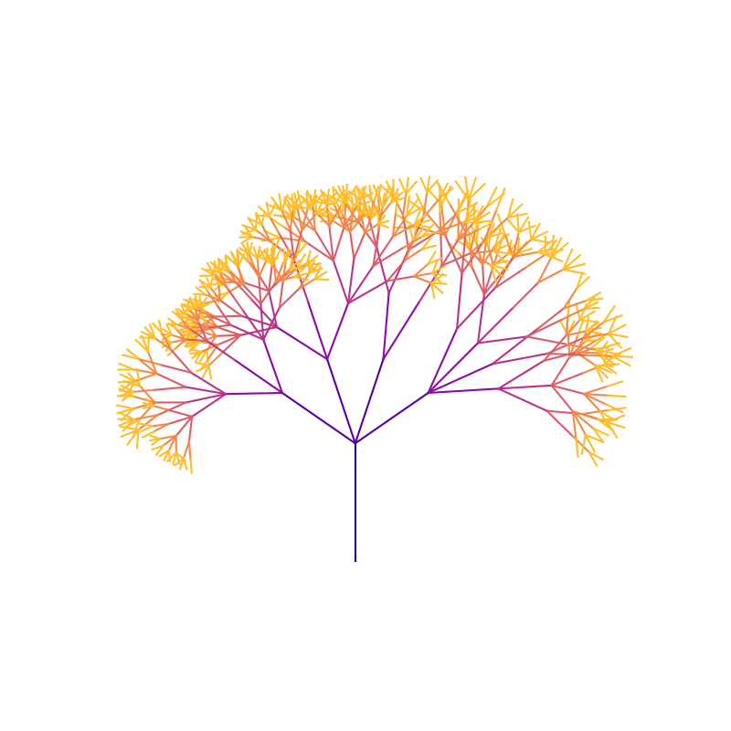
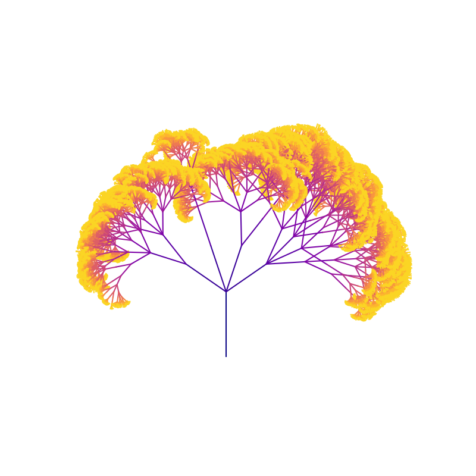
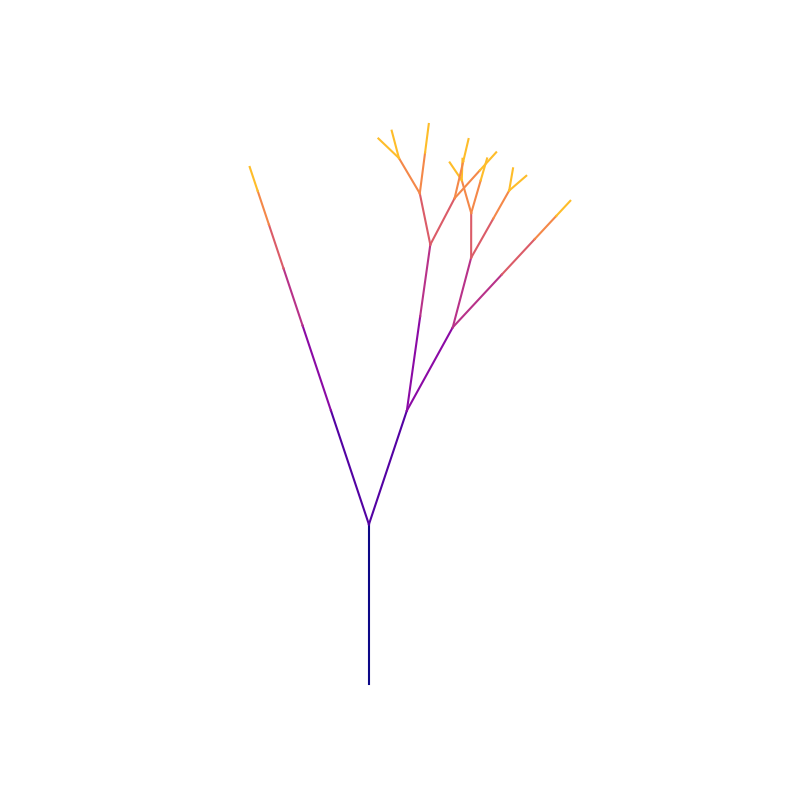
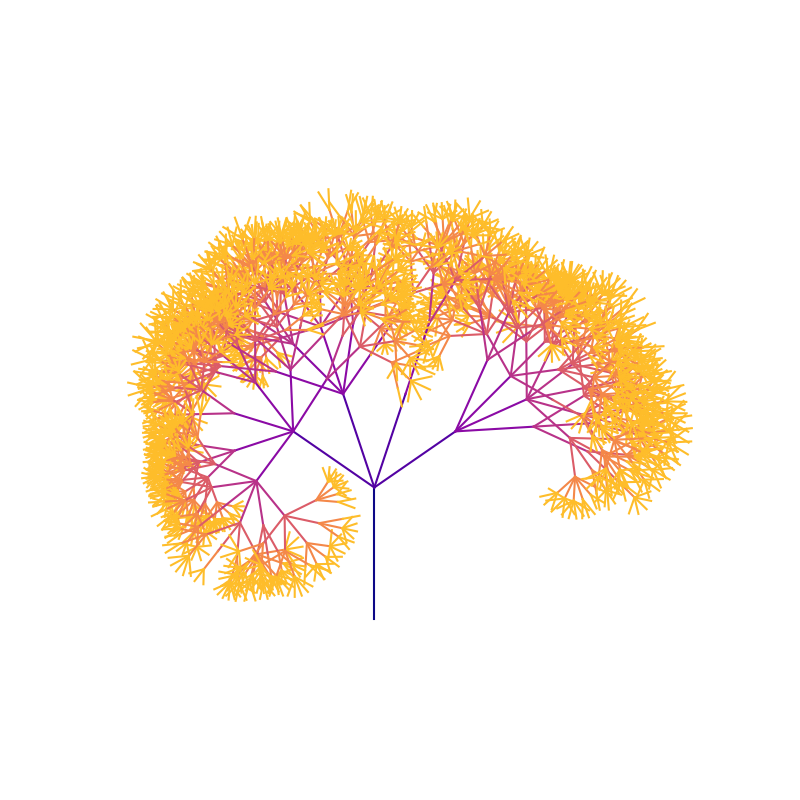
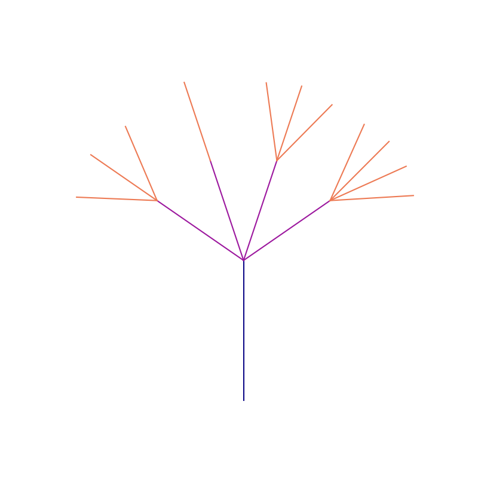

# Assignment 2: Fractal Generation Documentation

## Table of Contents

- [Pseudo-Code](#pseudo-code)
- [Technical Explanation](#technical-explanation)
- [Results](#results)
- [Challenges and Solutions](#challenges-and-solutions)
- [References](#references)

---

## Pseudo-Code

1. **Import Libraries**
- Import necessary libraries (e.g., NumPy for array manipulation and Matplotlib for visualization).

2. **Set Random Seed for Reproducibility**
- Use `random.seed()` to ensure the same fractal structure is generated every time the code runs.

3. **Initialize Fractal Parameters**
- Define initial parameters for the fractal tree:
  - `start_x`, `start_y`: Starting coordinates at the origin (base of the tree).
  - `initial_angle`: Initial branch angle set to 90 degrees (pointing upwards).
  - `length`: Length of the first branch segment.
  - `recursion_depth`: Maximum recursion depth, determining tree "height" and complexity.
  - `max_branches`: Maximum number of branches that can emerge from each node.

4. **Define Color Function**
- Define `get_color(depth, max_depth)` function to map depth to a color gradient.

5. **Define Recursive Branch Function**
- Define the recursive function `draw_branch(x, y, direction, length, depth)` to generate the fractal:
  - **Inputs:**
    - `x`, `y`: Current coordinates of the branch start point.
    - `direction`: Current angle of the branch in radians.
    - `length`: Current branch length.
    - `depth`: Current recursion depth.
  - **Base Case:**
    - If `depth` is 0, end recursion (return).
  - **Calculate Endpoint:**
    - Compute endpoint of the current branch using trigonometry:
      - `end_x = x + length * cos(direction)`
      - `end_y = y + length * sin(direction)`
  - **Create Line Segment and Plot:**
    - Define a line from `(x, y)` to `(end_x, end_y)` using `LineString`.
    - Plot the branch with a color based on depth using `get_color()`.
  - **Set Random Parameters:**
    - Define `angle_change` (random angle change between branches, e.g., 20 to 40 degrees).
    - Define `length_scaling_factor` (randomly scale branch length for each recursion, e.g., 0.6 to 0.8).
    - Set `num_branches` to a random integer (up to `max_branches`).
  - **Calculate New Length and Angle Distribution:**
    - Compute `new_length = length * length_scaling_factor`.
    - Calculate total spread of angles across branches:
      - `total_angle = (num_branches - 1) * angle_change`
    - Center branches around the main angle by setting `starting_angle = -total_angle / 2`.
  - **Recursive Call for Branch Creation:**
    - For each branch (`i` ranging from 0 to `num_branches - 1`):
      - Calculate `branch_angle = starting_angle + i * angle_change`.
      - Convert `branch_angle` to radians and adjust direction.
      - Recursively call `draw_branch(end_x, end_y, direction + radians(branch_angle), new_length, depth - 1)`.

6. **Plot Setup for Visualization**
- Configure the plot:
  - Define figure size using `plt.figure(figsize=(8, 8))`.
  - Use `plt.axis('equal')` to maintain the aspect ratio.
  - Turn off plot axes using `plt.axis('off')` for a cleaner look.

7. **Generate Fractal Tree**
- Begin the fractal generation by calling `draw_branch(start_x, start_y, radians(initial_angle), length, recursion_depth)`.

8. **Display the Fractal Pattern**
- Use `plt.show()` to render and display the generated fractal tree pattern.

---

## Technical Explanation

In this approach, the `draw_branch` function uses recursion to generate a fractal tree pattern, where each branch splits into a random number of smaller branches, creating a tree-like structure. This recursive approach is based on trigonometry and randomness to calculate the position, direction, and branching of each line segment.

Starting from an initial point, angle, and length, `draw_branch` calculates the endpoint of each branch using trigonometric functions. At each recursive step, the function:

- Reduces the Branch Length: The length of each new branch is scaled down by a randomly chosen `length_scaling_factor`.
- Adjusts the Angle: A random `angle_change` between 20 and 40 degrees is applied to each branch, allowing for organic variations in direction. 
- Randomizes the Number of Branches: The number of branches emerging from each node is determined randomly, up to a maximum `max_branches`. This randomness adds further natural variation.
- Draws and Colors Each Branch: The Shapely library is used to define each branch geometrically, and matplotlib plots it with a color based on depth.

The recursion ends when the depth reaches zero, producing a finite fractal. By applying randomness to the number of branches, length, and angle at each level, a natural and complex pattern is achieved.

---

## Results

### Base Fractal Tree

#### Fractal Tree 1: 

- **Parameters**:
  - `recursion_depth`: 7
  - `max_branches`: 4
- **Observations**:
  - As the recursion depth increases, the branches show a higher level of detail, creating a dense canopy-like structure.
  - The gradual color transition from purple at the base to yellow at the outer branches highlights the branching levels.

### Changing Recursion Depth

#### Fractal Tree 2:

- **Parameters**:
  - `recursion_depth`: 12
  - `max_branches`: 4
- **Observations**:
  - This tree displays a thicker and fuller appearance due to dense branch formations.
  - It appears more organic and realistic, resembling a flowering plant or tree canopy.

#### Fractal Tree 3:

- **Parameters**:
  - `recursion_depth`: 3
  - `max_branches`: 4
- **Observations**:
  - This tree has a sparse structure with elongated branches, showing minimal recursion.
  - It resembles an early branching structure, focusing on simplicity and wide angles.

### Changing Max Branches

#### Fractal Tree 4:

- **Parameters**:
  - `recursion_depth`: 7
  - `max_branches`: 6
- **Observations**:
  - The tree has a balanced and moderately dense branching pattern.
  - As recursion depth increases, the branches fill out, but still retain an airy and light structure.

#### Fractal Tree 5:

- **Parameters**:
  - `recursion_depth`: 7
  - `max_branches`: 2
- **Observations**:
  - This shape resembles the early stages of growth, capturing an essence of initial branching.
  - The tree is minimalistic, with few branches.

---

## Challenges and Solutions

- **Challenge**: Ensuring Consistency with Randomness.
  - **Solution**: Using a fixed random seed (`random.seed(0)`) ensured that the fractal structure remained consistent each time the code ran. 

- **Challenge**: Handling Edge Cases in Geometry Calculations.
  - **Solution**: I implemented minimum and maximum constraints for angle changes and length scaling to avoid extreme values. This prevented branches from becoming too vertical or horizontal, resulting in a more balanced and stable fractal structure.

- **Challenge**: Managing Color Contrast Based on Depth.
  - **Solution**: By mapping the `recursion_depth` directly to a color in the `plt.cm.plasma` colormap, I ensured that each level had a distinct color.

---

## References

- Setting Random Seed: [Python Random seed() Method](https://www.w3schools.com/python/ref_random_seed.asp)
- Shapely Manual: [LineString Geometry](https://shapely.readthedocs.io/en/2.0.3/manual.html#linestrings)
- Shapely Manual: [Geometric Objects](https://shapely.readthedocs.io/en/2.0.3/manual.html#geometric-objects)
- Matplotlib Documentation: [Colormaps](https://matplotlib.org/stable/users/explain/colors/colormaps.html#colormaps)

---